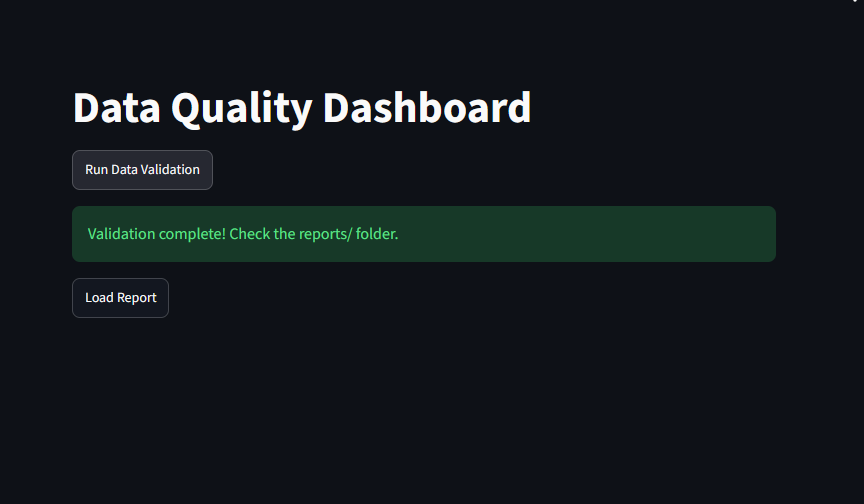
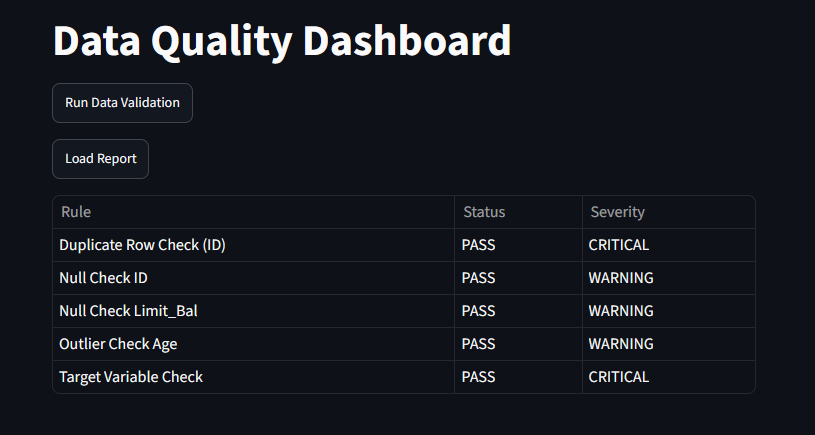

# SQL Data Quality Validator

A Python and SQL-based data validation framework that automatically checks database integrity and generates structured reports before data is used for analysis or reporting.

## Business Scenario

This tool simulates a real-world data quality validation pipeline used in analytics and data engineering workflows. It ensures that raw datasets are transformed into validated, analysis-ready data, preventing downstream reporting errors.

## Solutions Implemented

* **Data Loading**: Automates the ingestion of CSV datasets into an SQLite database.
* **Validation Engine**: Runs SQL-based validation rules driven by a flexible JSON configuration.
* **Reporting System**: Generates comprehensive CSV and HTML reports with severity-based scoring.
* **Interactive Dashboard**: Provides a Streamlit interface to run validations and visualize results in real-time.

## Project Workflow

This diagram outlines the automated data engineering pipeline, showing how raw data moves through the validation engine to generate reports and populate the interactive dashboard.

## Tools Used

* **Language**: Python
* **Database**: SQLite
* **Visualization/UI**: Streamlit
* **Data Processing**: Pandas

## Technical Skills

* **Data Engineering**: Proficient in building automated ingestion and validation pipelines.
* **SQL**: Experienced in writing complex integrity checks and rule-based queries.
* **Configuration Management**: Skilled in designing JSON-driven engines for scalable rule sets.
* **Business Intelligence**: Capable of creating actionable dashboards that translate technical findings into data quality scores.

## Key Insights

* **Automated Scoring**: Computes a 0–100 score based on critical issues and failed checks.
* **Rule Engine**: Configurable via JSON to handle duplicate detection, null checks, and outlier detection.
* **Actionable Reporting**: Provides immediate feedback via terminal, HTML, and browser-based dashboards.

## How to View

1. **Clone the repository**:
   `git clone https://github.com/your-username/SQL-Data-Quality-Validator.git`
   `cd SQL-Data-Quality-Validator`
2. **Setup**: Create a virtual environment and install dependencies:
   `pip install -r requirements.txt`
3. **Run Pipeline**:
   `python src/load_data.py` (Loads Data)
   `python src/validator.py` (Runs Validation)
4. **Dashboard**:
   `streamlit run app.py`

## Dashboard Preview

